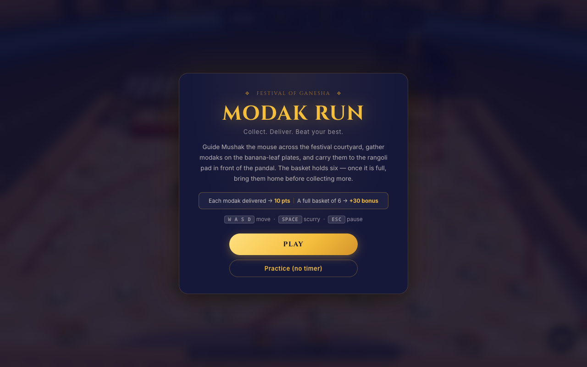
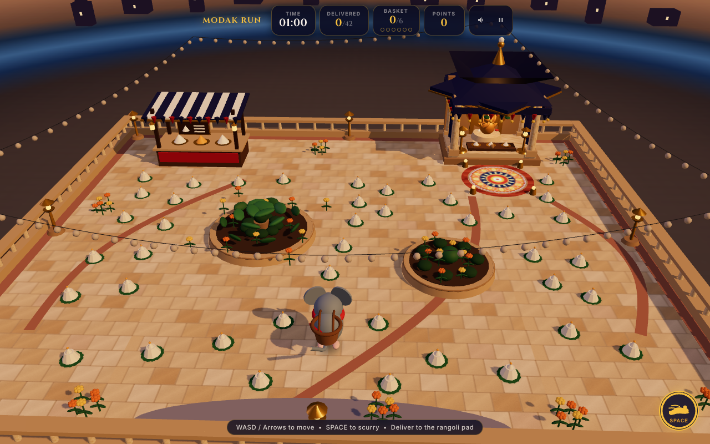
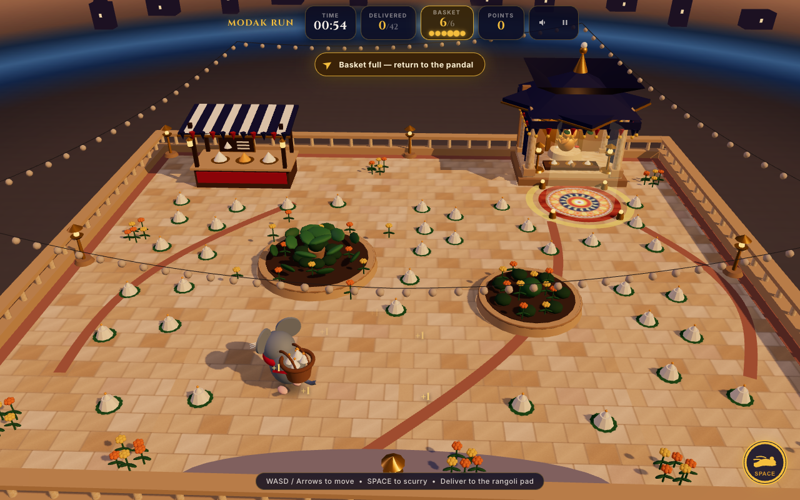
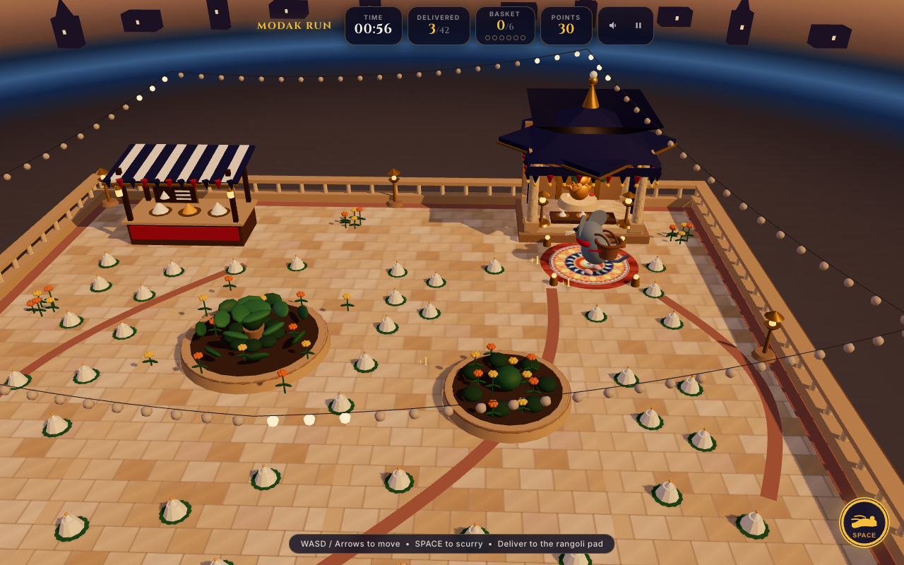

# 🐭 Modak Ran (Mushak's Modak Run) 🪔

[](https://www.typescriptlang.org/)
[](https://threejs.org/)
[](https://rapier.rs/)
[](https://vitejs.dev/)
[](https://opensource.org/licenses/MIT)

> **A high-performance, handcrafted 3D festive diorama game celebrating Ganesh Chaturthi.**  
> Guide Mushak across a luminous twilight temple courtyard, gather golden modaks into your woven basket, and race to deliver them to Lord Ganesha's sanctum before the 60-second festival bell tolls!

---

## 🌟 Visual Showcase

| Festival Sanctuary & Dusk Lighting | Active Gameplay & Modak Collection |
|:---:|:---:|
|  |  |

| Basket Capacity & Return Nav Indicator | Offering Delivered & Festive Score Multiplier |
|:---:|:---:|
|  |  |

---

## 🏆 Key Highlights & Features

### 1. 🪔 Pure Procedural Artistry (Zero Downloaded Assets)
- **100% Procedural 3D Geometry**: Every pillar, carved archway, modak with folded pleats, brass diya flame, marigold flower garland, and Mushak's expressive mouse model are generated algorithmically with Three.js primitives and custom buffer geometry.
- **Canvas-Generated Dynamic Textures**: Floor stone tiles, intricate floral rangolis, festive torans, and fabric curtains are synthesized on in-memory HTML5 canvases at startup. Zero external images or third-party 3D model downloads — instant sub-second boot time!
- **Pure Web Audio API Sound Synthesizer**: Procedurally synthesizes authentic cultural soundscapes (temple chime arpeggios, gentle scurry footfalls, offering gongs, and ambient festival hums) with zero audio asset requests.

### 2. ⚡ Authoritative Simulation & Deterministic Rapier3D Physics
- **Strict Decoupled Architecture**: Authoritative 60 Hz fixed-step state machine (`src/core/simulation.ts`) governs character movement, pickup radii, delivery triggers, capacity rules, and scoring. The rendering layer strictly mirrors immutable snapshots.
- **Rapier3D Kinematic Character Controller**: True 3D continuous collision detection and realistic obstacle sliding. Mushak glides cleanly along stone walls, pillars, and raised sanctum steps without tunneling or jitter.
- **Scurry Burst Mechanic**: Strategic dash capability with dedicated cooldown tracking and visual meter, empowering players to execute precision routes through courtyard obstacles.

### 3. 📱 Universal Cross-Platform Responsive Controls
- **Desktop**: Tight WASD / Arrow keyboard locomotion + Spacebar Scurry burst + Escape/P toggleable pause pill.
- **Mobile & Touch**: Built-in dynamic floating virtual thumbstick with haptic-styled responsiveness, one-tap Scurry action button with circular cooldown dial, and safe-area inset protection for notch displays.

### 4. 🪷 Cultural Reverence & Authentic Detailing
- Lord Ganesha's idol sits peacefully enshrined in the sacred sanctum under warm oil-lamp illumination, respectfully isolated from any damage, comical distortion, or direct collision mechanics.
- Authentic festive mechanics: modaks are placed on auspicious rangoli pads, and delivering offerings progressively illuminates hanging festive string lights (*akash kandils* and lanterns) across the courtyard.

---

## 🎮 How to Play & Game Rules

### Objective
Mushak can carry up to **6 modaks** at a time in his wicker basket. Collect modaks scattered across the courtyard and deliver them onto the glowing sacred rangoli pad in front of the pandal before the 60-second festival timer runs out!

### Scoring Matrix
| Metric | Rule | Points Awarded |
| :--- | :--- | :--- |
| **Standard Delivery** | Each modak successfully brought to sanctum | **+10 pts** each |
| **Full Basket Bonus** | Delivering a full payload of 6 modaks at once | **+30 bonus pts** |
| **Prowess Strategy** | Collecting all 42 modaks across 7 full-capacity runs | **Score Max / Mastery** |
| **Personal Best** | Automatic local storage persistence | Displayed with detailed itemized breakdown |

### Controls
| Action | Desktop Controls | Mobile / Touch Controls |
| :--- | :--- | :--- |
| **Move / Navigate** | `W` `A` `S` `D` or Arrow Keys | Bottom-Left Analog Joystick |
| **Scurry (Dash)** | `Spacebar` (3s cooldown) | Bottom-Right Scurry Button |
| **Pause Game** | `P`, `Esc`, or Pause Button | Header Pause Pill |
| **Sound Toggle** | Audio Pill (Mute / Unmute) | Header Audio Pill |

---

## 🏗️ Architecture & Clean Code Philosophy

The codebase enforces strict separation of concerns between physics, gameplay logic, and Three.js visual presentation:

```
src/
├── contracts/        # Immutable domain definitions (GameSnapshot, GameCommand, Events, Level)
├── core/             # Authoritative deterministic simulation, pickup checks, delivery & scoring
├── physics/          # Rapier3D kinematic character controller, wall colliders, and collision groups
├── level/            # Courtyard world layout, pillar placements, 42 collectible points, delivery zone
├── presentation/     # Three.js diorama, lighting, Mushak rig, procedural audio & reactive HUD
└── main.ts           # Orchestration loop connecting simulation ticks to WebGL frame rendering
```

### Key Engineering Invariants
1. **Unidirectional State Flow**: Rendering components only consume read-only snapshots and never modify game state directly.
2. **Deterministic Mechanics**: All 42 modak spawn coordinates are verified by automated collision tests to ensure 100% reachability and collision safety.
3. **Optimized Asset Pipeline**: Production bundle compiles to lightweight static files served anywhere (domain root or nested subpaths).

---

## 🚀 Quick Start & Development

### Prerequisites
- **Node.js**: v18.0.0 or later
- **npm**: v9.0.0 or later

### 1. Clone & Install
```bash
git clone https://github.com/Karan-Raj-KR/modak-ran.git
cd modak-ran
npm install
```

### 2. Run Locally in Development Mode
```bash
npm run dev
```
Open [http://localhost:5173](http://localhost:5173) in your browser.

### 3. Run Verification & Test Suites
Comprehensive automated testing covering gameplay mechanics, contract invariants, level geometry, and Rapier3D physics collision:
```bash
npm test
```

### 4. Build Production Bundle
```bash
npm run build
npx vite preview
```

---

## 🧪 Comprehensive Automated Test Suites

The repository features comprehensive automated test coverage across 5 dedicated test suites:
- `tests/rules.test.ts`: Validates capacity constraints, one-time pickup guarantees, scoring, and timer expiration.
- `tests/map.test.ts`: Verifies all 42 modak coordinates are topologically valid, accessible, and outside the delivery zone.
- `tests/gameplay/mechanics.test.ts`: Validates diagonal velocity normalization, scurry dash cooldowns, and round restarts.
- `tests/physics/collision.test.ts`: Verifies Rapier3D boundary collision containment, obstacle sliding, and anti-tunneling physics.
- `tests/gameplay/features.test.ts`: Exercises bonus scoring calculations, practice mode, ghost tracking, and state transitions.

---

## 📜 Technology Stack

- **Graphics Core**: [Three.js](https://threejs.org/) (r174+)
- **Physics Engine**: [Rapier3D](https://rapier.rs/) (WebAssembly 3D Physics)
- **Language**: [TypeScript](https://www.typescriptlang.org/) (Strict Type Checking)
- **Build Tool**: [Vite](https://vitejs.dev/)
- **Audio**: Web Audio API (Hardware-accelerated procedural synthesis)
- **Testing**: Node test runner with `tsx`

---

## ⚖️ Cultural Integrity & Licensing

- **Respect & Sanctity**: Developed with reverence for Ganesh Chaturthi traditions. The sanctum and Lord Ganesha's idol are depicted with dignity under tranquil temple illumination.
- **Open Source**: Released under the [MIT License](LICENSE).
